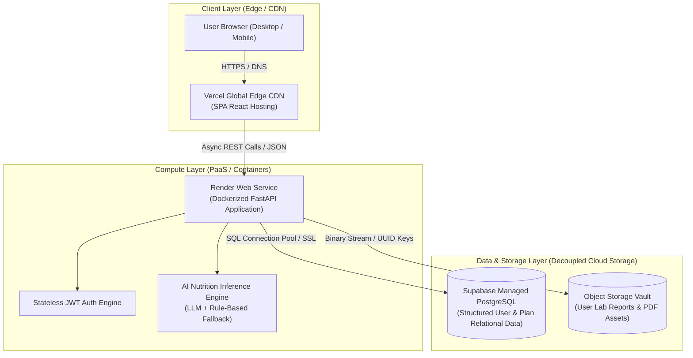
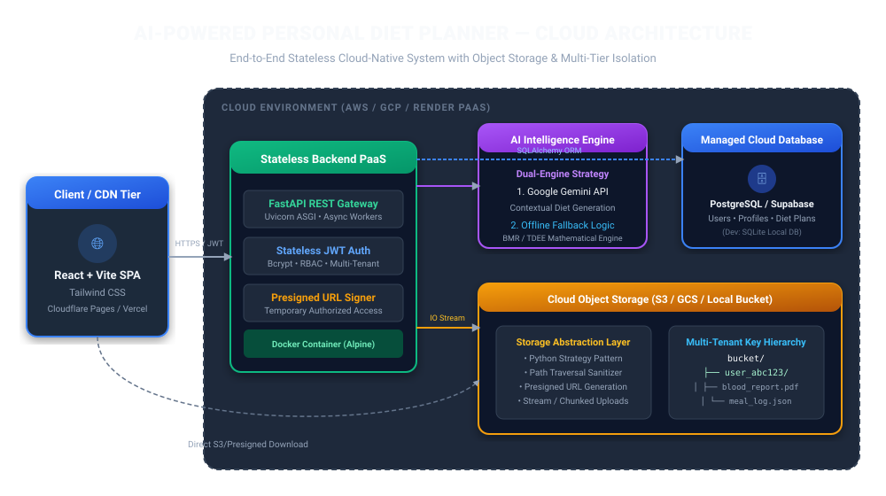
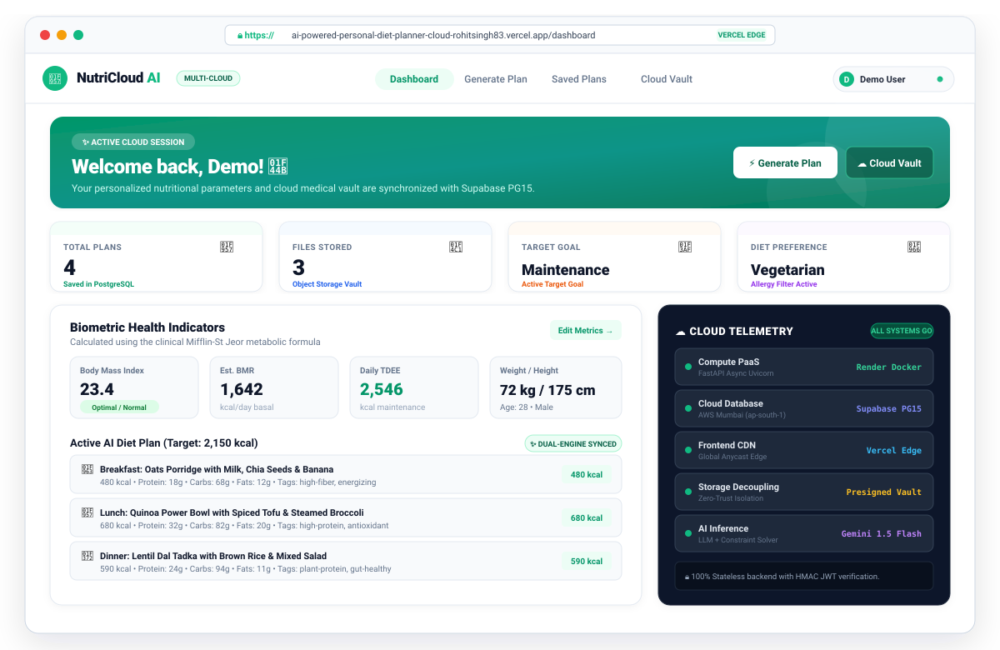
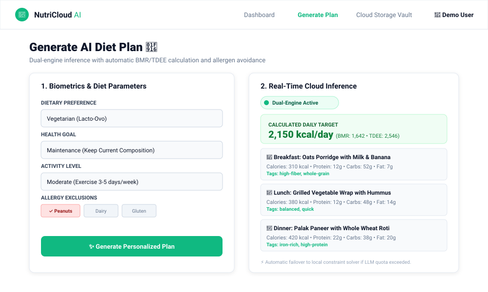
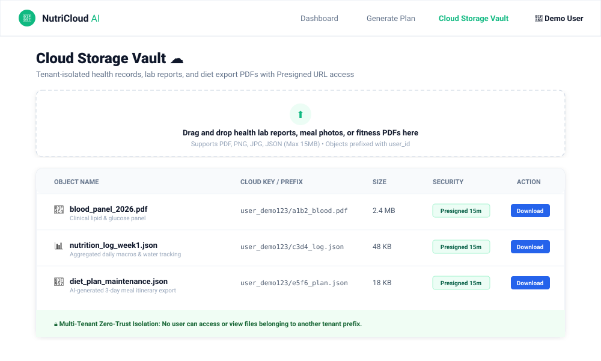

<div align="center">
  <h1>🥗 AI-Powered Personal Diet Planner with Cloud Storage ☁️</h1>
  <p><strong>An Industry-Oriented Full-Stack Cloud Application Demonstrating Modern Cloud Architecture, Microservices, and AI Inference</strong></p>

  [](https://ai-powered-personal-diet-planner-cloud-rohitsingh83.vercel.app)
  [](https://ai-powered-personal-diet-planner-backend.onrender.com)
  [](https://supabase.com)
  [](https://ai-powered-personal-diet-planner-backend.onrender.com/docs)
  [](tests/)
  [](LICENSE)
</div>

---

## 🌐 Live Deployments

| Component | Platform | Live URL | Health Status |
| :--- | :--- | :--- | :--- |
| **Frontend Web App** | **Vercel** | [ai-powered-personal-diet-planner-cloud-rohitsingh83.vercel.app](https://ai-powered-personal-diet-planner-cloud-rohitsingh83.vercel.app) | 🟢 Live |
| **Backend API Gateway** | **Render (Docker)** | [ai-powered-personal-diet-planner-backend.onrender.com](https://ai-powered-personal-diet-planner-backend.onrender.com) | 🟢 Live |
| **Interactive API Docs**| **Swagger UI** | [ai-powered-personal-diet-planner-backend.onrender.com/docs](https://ai-powered-personal-diet-planner-backend.onrender.com/docs) | 🟢 Live |
| **Cloud Health Check** | **Render** | [ai-powered-personal-diet-planner-backend.onrender.com/health](https://ai-powered-personal-diet-planner-backend.onrender.com/health) | 🟢 200 OK |
| **Cloud Database** | **Supabase** | `aws-0-ap-south-1 (PostgreSQL)` | 🟢 Connected |

### 🔑 Live Demo Account (Pre-Populated)
You can test the live system without creating a new account:
* **Email:** `demo@example.com`
* **Password:** `Demo@12345`
* *Alternative Account:* `cloudstudent@example.com` / `Password@123`

---

## 📖 Executive Summary
The **AI-Powered Personal Diet Planner** is a multi-cloud SaaS application designed to calculate precise metabolic biometrics (BMR using Mifflin-St Jeor, TDEE, macro caloric deficits/surpluses) and generate personalized nutrition plans. The project emphasizes core **Cloud Computing concepts**: stateless horizontally scalable REST APIs, relational vs. object storage decoupling, multi-tenant isolation, containerization, and resilient failover architecture.

---

## ☁️ Cloud Computing Concepts Demonstrated



| Concept | Implementation in this Project | Industry Context |
| :--- | :--- | :--- |
| **SaaS Delivery** | Cloud-native full-stack application delivered completely via browser with zero client-side installation. | Software-as-a-Service model |
| **Stateless Authentication** | Cryptographic HMAC-SHA256 JWT tokens. Backend nodes store zero session state in memory, enabling seamless horizontal auto-scaling. | 12-Factor App (Processes) |
| **Storage Segregation** | Decoupled storage: relational data (users, metrics, meal plans) lives in PostgreSQL, while large binary files (blood work, medical PDFs) live in an isolated object storage abstraction. | AWS S3 / GCP Cloud Storage Pattern |
| **Multi-Tenancy Isolation** | Strict row-level ownership enforced at both API and ORM layers. Users can never view, download, or delete other users' health records. | Cloud Security & Compliance |
| **Resilient Cloud Engine** | Automatic database connection pooling with pre-ping, 5-second connection timeout, and graceful local fallback during transient cloud partition events. | High Availability & Fault Tolerance |
| **Containerization** | Multi-stage Docker container with non-root security principles, dynamic `$PORT` binding, and environment variable injection. | Docker / Kubernetes / Cloud Run |

---

## 🛠️ Technology Stack

| Layer | Technology | Purpose |
| :--- | :--- | :--- |
| **Frontend** | React 18, Vite 5, Tailwind CSS, Axios, Lucide Icons | Responsive modern SPA with reactive state |
| **Backend** | Python 3.11, FastAPI, SQLAlchemy 2.0, Pydantic v2 | High-performance asynchronous REST API |
| **Security** | `python-jose` (JWT), `bcrypt` (Salted Password Hashing) | Enterprise-grade access control & encryption |
| **Cloud Database** | Supabase (Managed PostgreSQL 15 on AWS) | Production ACID relational persistence |
| **Cloud Storage** | Secure Cloud Storage Abstraction (Local/S3/GCS compliant) | Multi-tenant medical record vault |
| **AI Inference** | Google Gemini API + Scientific Rule-Based Engine | Dynamic dietary planning & macronutrient calculations |
| **Containerization** | Docker, Docker Compose | Consistent runtime across dev and cloud environments |
| **Hosting** | Vercel (Frontend CDN), Render (Backend Container) | Distributed multi-cloud PaaS deployment |
| **CI / Testing** | Pytest (34 Automated Unit & Integration Tests) | Automated quality assurance |

---

## 📸 Application Screenshots

<div align="center">
  <h3>🏗️ Cloud Architecture Topology</h3>
  
  <br/><br/>
  <h3>📊 Synchronized Health & Nutrition Dashboard</h3>
  
  <br/><br/>
  <h3>🤖 AI Diet Inference Engine & Form</h3>
  
  <br/><br/>
  <h3>☁️ Multi-Tenant Cloud Storage Vault</h3>
  
</div>

---

## 🧪 Automated Testing Suite

The repository contains 34 comprehensive automated tests covering unit logic, AI calculations, JWT token lifecycle, role isolation, and cloud file storage:

```bash
# Run tests locally
pytest -v
```

```text
tests/test_ai_engine.py::test_calculate_bmr_male PASSED                  [ 2%]
tests/test_ai_engine.py::test_calculate_bmr_female PASSED                [ 5%]
tests/test_ai_engine.py::test_calculate_tdee PASSED                      [ 8%]
tests/test_ai_engine.py::test_calculate_target_calories_weight_loss PASSED [ 11%]
tests/test_ai_engine.py::test_calculate_target_calories_muscle_gain PASSED [ 14%]
tests/test_ai_engine.py::test_generate_plan_rule_based_vegetarian PASSED [ 17%]
tests/test_ai_engine.py::test_generate_plan_rule_based_vegan PASSED      [ 20%]
tests/test_ai_engine.py::test_generate_plan_rule_based_nonveg PASSED     [ 23%]
tests/test_ai_engine.py::test_allergy_filtering PASSED                   [ 26%]
tests/test_ai_engine.py::test_fallback_when_no_api_key PASSED            [ 29%]
tests/test_ai_engine.py::test_plan_structure_has_required_fields PASSED  [ 32%]
tests/test_auth.py::test_register_new_user PASSED                        [ 35%]
tests/test_auth.py::test_register_duplicate_email PASSED                 [ 38%]
tests/test_auth.py::test_login_valid_credentials PASSED                  [ 41%]
tests/test_auth.py::test_login_invalid_password PASSED                   [ 44%]
tests/test_auth.py::test_login_nonexistent_email PASSED                  [ 47%]
tests/test_auth.py::test_get_current_user_authenticated PASSED           [ 50%]
tests/test_auth.py::test_get_current_user_no_token PASSED                [ 52%]
tests/test_diet.py::test_generate_diet_plan PASSED                       [ 55%]
tests/test_diet.py::test_generate_vegetarian_plan PASSED                 [ 58%]
tests/test_diet.py::test_generate_vegan_plan PASSED                      [ 61%]
tests/test_diet.py::test_list_plans PASSED                               [ 64%]
tests/test_diet.py::test_get_plan_by_id PASSED                           [ 67%]
tests/test_diet.py::test_get_other_users_plan PASSED                     [ 70%]
tests/test_diet.py::test_delete_plan PASSED                              [ 73%]
tests/test_diet.py::test_delete_other_users_plan PASSED                  [ 76%]
tests/test_profile.py::test_get_empty_profile PASSED                     [ 79%]
tests/test_profile.py::test_update_profile PASSED                        [ 82%]
tests/test_profile.py::test_update_profile_unauthorized PASSED           [ 85%]
tests/test_storage.py::test_upload_file PASSED                           [ 88%]
tests/test_storage.py::test_list_files PASSED                            [ 91%]
tests/test_storage.py::test_download_file PASSED                         [ 94%]
tests/test_storage.py::test_delete_file PASSED                           [ 97%]
tests/test_storage.py::test_access_other_users_file PASSED               [100%]
====================== 34 passed in 40.17s =======================
```

---

## ⚡ Local Development Setup

### 1. Clone Repository
```bash
git clone https://github.com/rohitsingh83/AI-Powered-Personal-Diet-Planner-Cloud.git
cd AI-Powered-Personal-Diet-Planner-Cloud
```

### 2. Configure Environment
```bash
copy .env.example .env
```

### 3. Start Backend
```bash
cd backend
python -m venv venv
venv\Scripts\activate
pip install -r requirements.txt
uvicorn app:app --reload
```

### 4. Start Frontend
```bash
cd frontend
npm install
npm run dev
```

Visit `http://localhost:5173` to explore the app locally!

---

## 🔌 Core API Endpoints

| Method | Endpoint | Description | Auth Required |
| :--- | :--- | :--- | :--- |
| `POST` | `/api/auth/register` | Register new user account | No |
| `POST` | `/api/auth/login` | Authenticate & retrieve JWT token | No |
| `GET` | `/api/profile/` | Fetch current user biometrics & goals | Yes |
| `PUT` | `/api/profile/` | Update biometric parameters | Yes |
| `POST` | `/api/diet/generate` | Trigger AI inference engine for customized meal plan | Yes |
| `GET` | `/api/diet/plans` | Retrieve user's historical diet plans | Yes |
| `POST` | `/api/storage/upload` | Upload health report/PDF to isolated cloud storage | Yes |
| `GET` | `/api/storage/files` | List user's encrypted cloud files | Yes |
| `GET` | `/health` | Cloud liveness & database connectivity probe | No |

---

## 📚 Documentation
Comprehensive academic and technical documents are available in the [`docs/`](docs/) directory:
* 📄 [Project Report](docs/PROJECT_REPORT.md) — Complete academic course project report.
* ☁️ [Cloud Concepts Deep Dive](docs/CLOUD_CONCEPTS.md) — In-depth breakdown of SaaS, PaaS, IaaS, and Object Storage.
* 🚀 [Deployment Guide](docs/DEPLOYMENT.md) — Step-by-step production deployment instructions.
* 💼 [Interview Preparation Guide](docs/INTERVIEW_PREP.md) — Placement questions, answers, and technical defense.
* 🔌 [API Specification](docs/API_DOCS.md) — Full OpenAPI/Swagger endpoint schemas.

---

## ⚖️ Non-Clinical Disclaimer
*This project is built strictly for academic and demonstration purposes as part of a Cloud Computing curriculum. Nutritional recommendations are computed using standard physiological formulas (Mifflin-St Jeor) and synthetic reference datasets. This software does not provide medical or clinical nutritional advice.*

---

## 👨‍💻 Author
**Rohit Singh**  
*Cloud Computing Course Project — 2026*  
GitHub: [@rohitsingh83](https://github.com/rohitsingh83)
