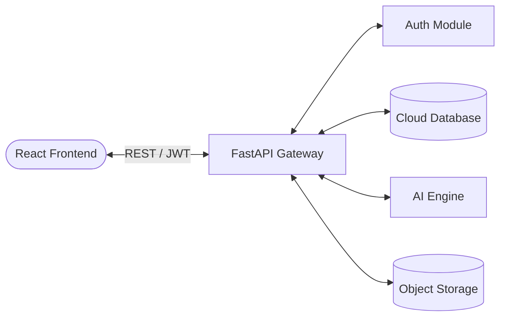

<div align="center">
  <h1>🥗 AI-Powered Personal Diet Planner ☁️</h1>
  <p><strong>A Full-Stack Cloud Application for Personalized Nutrition</strong></p>

  
  
  
  
</div>

---

## 📖 Overview
The **AI-Powered Personal Diet Planner** is a modern SaaS application that generates highly customized nutritional plans. By calculating precise biometrics (BMR, TDEE) and leveraging AI engines, it builds diet plans tailored to specific goals, dietary preferences, and allergies. Built with a scalable, stateless cloud architecture.

## ⚠️ Problem Statement
Generic diets fail because they ignore individual physiological differences. Hiring nutritionists is expensive. This platform democratizes personalized health by utilizing advanced algorithms and cloud computing to instantly generate, store, and manage user-specific diet plans and health records.

## ✨ Features
- [x] **Secure Authentication:** Stateless JWT token-based login and registration.
- [x] **Profile Management:** Track biometrics, activity levels, goals, and allergies.
- [x] **AI Generation Engine:** Dual-layer recommendation (LLM + Mathematical Rule-based fallback).
- [x] **Cloud Storage Abstraction:** Upload and manage health reports/PDFs safely.
- [x] **Modern UI:** Responsive React frontend built with Tailwind CSS.
- [x] **Comprehensive Testing:** Automated test suite ensuring reliability.

## 🏗️ Architecture Diagram


## 🛠️ Technology Stack
| Layer | Technology |
|-------|------------|
| Frontend | React, Vite, Tailwind CSS, Axios |
| Backend | Python, FastAPI, SQLAlchemy, Pydantic |
| Database | SQLite (Dev) / PostgreSQL (Prod) |
| Cloud Storage | File System Abstraction (Ready for AWS S3/GCP) |
| AI | Gemini API + Custom Algorithm |
| Testing/CI | Pytest, GitHub Actions |

## 🚀 Quick Start
Get up and running in minutes!

```bash
# 1. Clone the repository
git clone https://github.com/yourusername/AI-Powered-Personal-Diet-Planner-Cloud.git
cd AI-Powered-Personal-Diet-Planner-Cloud

# 2. Start the Backend
cd backend
python -m venv venv
source venv/bin/activate  # (Windows: venv\Scripts\activate)
pip install -r requirements.txt
uvicorn app:app --reload

# 3. Start the Frontend (In a new terminal)
cd frontend
npm install
npm run dev
```
*(Visit `http://localhost:5173` to view the app!)*

<div align="center">
  <h3>🏗️ Cloud Architecture Topology</h3>
  
  <br/><br/>
  <h3>📊 Synchronized Health & Nutrition Dashboard</h3>
  
  <br/><br/>
  <h3>🤖 AI Diet Inference Engine & Form</h3>
  
  <br/><br/>
  <h3>☁️ Multi-Tenant Cloud Storage Vault</h3>
  
</div>

### 🔑 Demo Account (Pre-Seeded)
To instantly populate realistic demo accounts, sample diet plans, and mock cloud files:
```bash
python backend/seed_data.py
```
* **Email:** `demo@example.com`
* **Password:** `Demo@12345`
* **Profile:** Age 25, 70kg, 175cm, Vegetarian, Goal: Maintenance


## ☁️ Cloud Computing Concepts
| Concept | Implementation in Project |
|---------|---------------------------|
| **SaaS** | Application delivered over web without client installation. |
| **Stateless Auth**| JWT tokens allow horizontal API scaling. |
| **Object Storage**| File uploads module designed to drop-in replace with S3. |
| **IaaS/PaaS** | Ready for deployment to Cloud Run / Render / AWS. |

## 🔌 API Endpoints Summary
| Method | Endpoint | Description | Auth Required |
|--------|----------|-------------|---------------|
| POST | `/api/auth/register` | Create a new user | No |
| POST | `/api/auth/login` | Authenticate and get JWT | No |
| PUT | `/api/profile/` | Update biometrics | Yes |
| POST | `/api/diet/generate` | Run AI engine for diet plan | Yes |
| POST | `/api/storage/upload`| Save file to cloud storage | Yes |

## 📂 Project Structure
```text
AI-Powered-Personal-Diet-Planner-Cloud/
├── ai_engine/          # Core mathematical logic and AI prompts
├── backend/            # FastAPI REST server
├── frontend/           # React user interface
├── tests/              # Comprehensive test suite
├── docs/               # Detailed documentation
└── .github/workflows/  # CI/CD pipelines
```

## 🧪 Testing
Run the comprehensive automated test suite (30+ tests) locally:
```bash
pytest tests/
```

## 🌍 Deployment
The architecture is designed to be cloud-native. Detailed deployment instructions for both Render (Free Tier) and Google Cloud Platform (Enterprise) are available in our [Deployment Guide](docs/DEPLOYMENT.md).

## 🔒 Security
- **Data Protection:** Passwords securely hashed with bcrypt.
- **Access Control:** User data strictly isolated via JWT validation.
- **Validation:** Pydantic models prevent NoSQL/SQL injection attacks.

## 📈 Scalability
The backend operates entirely statelessly. In a production environment, the FastAPI application can scale out to hundreds of nodes behind a Load Balancer, connecting to a managed PostgreSQL cluster.

## 🤝 Contributing
Contributions are welcome! Please open an issue first to discuss proposed changes. Ensure tests pass before submitting PRs.

## ⚖️ Disclaimer
*This application provides estimates based on standard BMR/TDEE formulas. It is not medical advice. Consult a registered dietitian before making severe dietary changes.*

## 📝 License
This project is licensed under the MIT License.

---
*Created by [Your Name] - Elevating health through code.*
